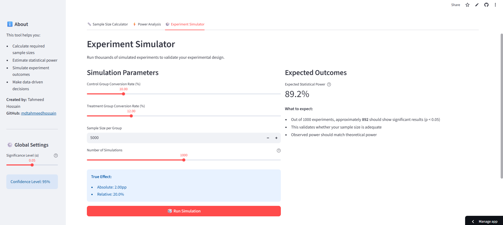

# A/B Testing Experimentation Calculator

Interactive tool for planning and validating A/B tests. Built with Streamlit.

**[Live Demo](https://ab-testing-experimentation-calculator.streamlit.app/)**



## Features

- **Sample Size Calculator** - figure out how many users you need for a given MDE and power
- **Power Analysis** - estimate power for your available sample, visualize power curves
- **Experiment Simulator** - Monte Carlo simulation to empirically validate your test design
- **CUPED Analysis** - variance reduction using pre-experiment covariates (simulated or manual data)
- **AI Assistant** - natural language interface (OpenAI function calling) that routes to the stats functions

## Setup

```bash
git clone https://github.com/mdtahmeedhossain/experimentation-calculator.git
cd experimentation-calculator
pip install -r requirements.txt
streamlit run app.py
```

For the AI assistant tab, add your OpenAI key:

```bash
cp .env.example .env
# edit .env with your key
```

## How it works

Sample size uses the standard two-proportion z-test formula:

```
n = 2 * ((z_α + z_β)^2 * σ^2) / δ^2
```

Power is `1 - Φ(z_α - δ/SE)`. The simulator generates binomial data for control/treatment, runs z-tests across thousands of iterations, and compares empirical power to theory.

CUPED adjusts outcomes using pre-experiment covariates: `Y_adj = Y_post - θ(Y_pre - E[Y_pre])` where `θ = Cov(Y_post, Y_pre) / Var(Y_pre)`. Variance reduction is approximately r^2.

## TODO

- [ ] Bayesian A/B testing
- [ ] Continuous metrics (not just conversion rates)
- [ ] Sequential testing / early stopping
- [ ] Export results to CSV

## Author

Tahmeed Hossain - [GitHub](https://github.com/mdtahmeedhossain) | [LinkedIn](https://linkedin.com/in/tahmeed-hossain-pial)
